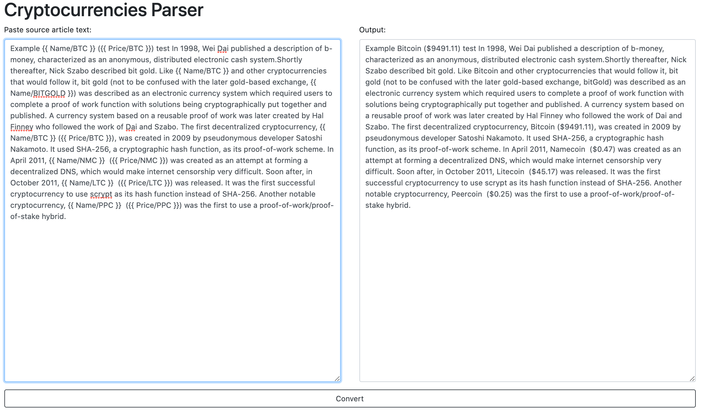

# cryptocurrencies parser

App parses source text and converts cryptocurrencies symbols to theirs current value and full name.
Name conversion example {{ Name/BTC }} -> Bitcoin.
Value conversion example {{ Price/BTC }} -> \$855.53.

In the project directory, you can run:

### `npm start`

